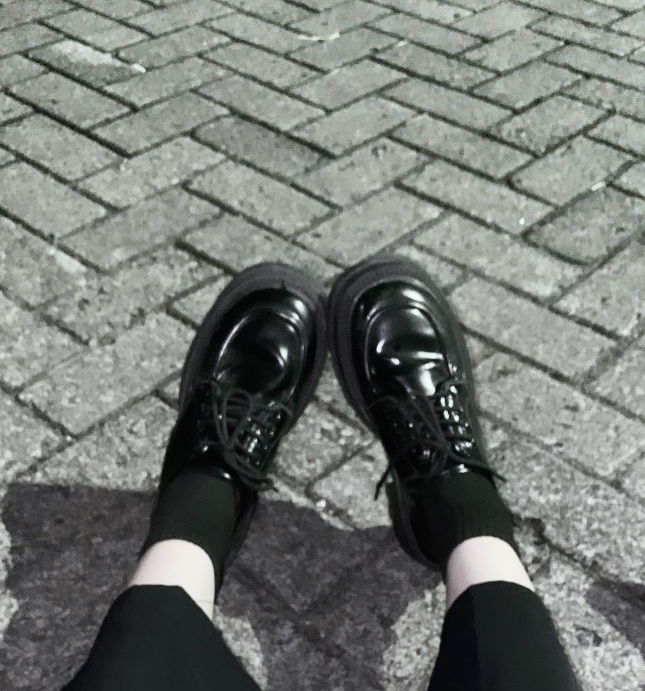
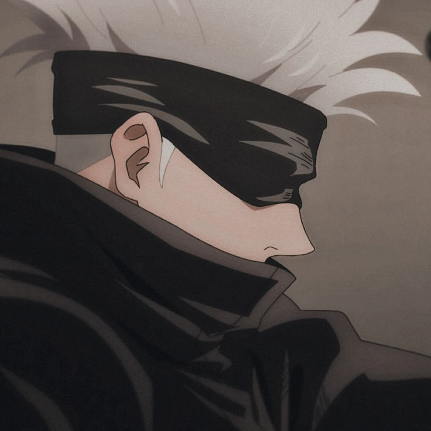

<html lang="en">
<head>
    <meta charset="UTF-8">
    <meta name="viewport" content="width=device-width, initial-scale=1.0">
    <title>chaxiee</title>
</head>
<body>

<header>
    <h1>chaxiee</h1>
</header>

<nav>
    <a href="#home">Home</a>
    <a href="#gallery">Gallery</a>
    <a href="#blog">Blog</a>
    <a href="#contact">Contact</a>
</nav>

<section id="home">
    <h2>Halaman Utama</h2>
    <h2>Hai, Nama saya Reza biasa disapa echa.</h2>
</section>

<section id="gallery">
    <h2>Galeri (Gallery)</h2>
    

        
        
        
        
        
        
    

</section>

<section id="blog">
    <h2>Blog</h2>
    

        <h3>Teknologi Blockchain: Mengubah Kepercayaan dan Transparansi</h3>
        
Blockchain, teknologi yang mendasari mata uang kripto seperti Bitcoin, telah mengubah paradigma dalam hal keamanan dan kepercayaan dalam transaksi online. 
            Dengan menggunakan sistem desentralisasi yang aman, blockchain memungkinkan transaksi yang terjamin keamanannya tanpa perlu mempercayai pihak ketiga. 
            Ini memiliki potensi untuk mengubah berbagai industri, mulai dari keuangan hingga logistik, dengan meningkatkan transparansi, mengurangi biaya, dan menghilangkan 
            kebutuhan akan perantara.

    

    

        <h3>Menyelami Kekuatan Cerita dalam Seni Visual</h3>
        
Seni visual adalah medium yang memungkinkan seniman untuk menyampaikan cerita, emosi, dan pesan melalui gambar, lukisan, atau fotografi. 
            Dengan menggunakan elemen-elemen seperti komposisi, warna, dan pencahayaan, seniman menciptakan karya yang mengundang pemirsa untuk merenungkan makna di baliknya. 
            Melalui seni visual, kita dapat memahami berbagai aspek kehidupan, merenungkan isu-isu sosial atau politik, dan merasakan keindahan serta kompleksitas dunia di sekitar kita.

    

    

        <h3>Musik dan Pengaruhnya terhadap Mood dan Emosi</h3>
        
Musik memiliki kemampuan unik untuk mengubah suasana hati dan emosi seseorang secara instan. 
            Ketika kita mendengarkan musik yang kita sukai, otak kita melepaskan hormon-hormon yang memicu perasaan senang atau tenang. 
            Musik yang ceria dapat meningkatkan mood positif, sementara musik yang lebih santai dapat menenangkan jiwa dan meredakan stres. 
            Fenomena ini menjadikan musik sebagai alat yang ampuh untuk mengatur suasana hati kita sehari-hari.

    

</section>

<section id="contact">
    <h2>Kontak (Contact)</h2>
    <!-- Formulir kontak -->
    <form class="contact-form" action="#" method="post">
        
Nama: Reza Michelly Cantika Mawara

        
Email: michellymawara@gmail.com

        
No Telepon: 085240216328

    </form>
</section>

<footer>
    
Hak Cipta &copy; 2024 

</footer>

</body>
</html>

